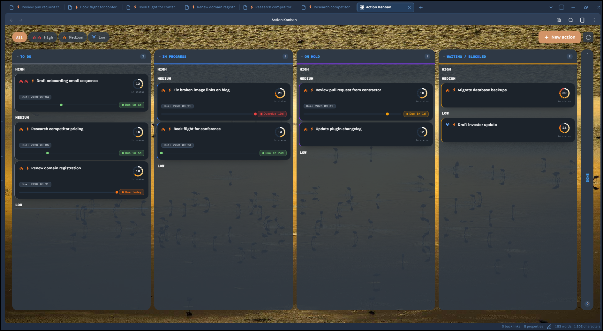
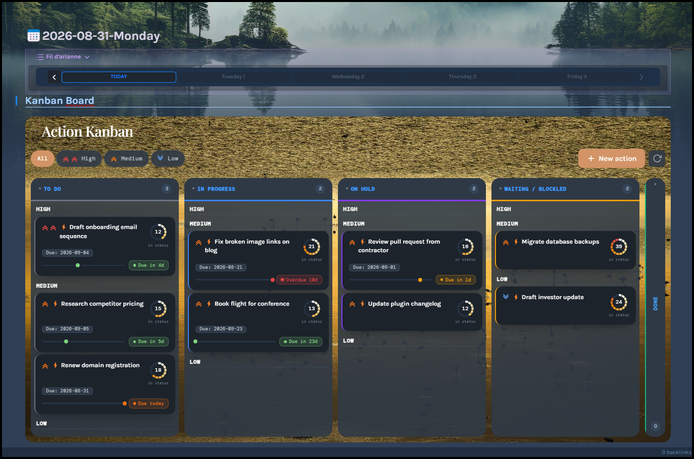
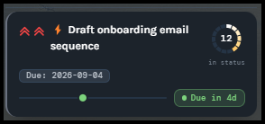
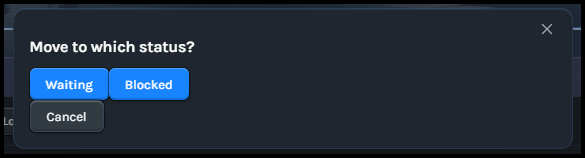
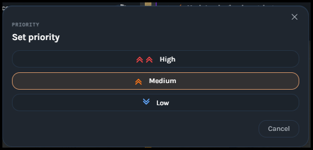
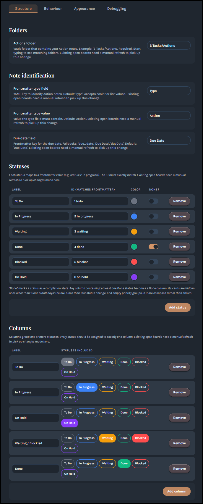

# Action Kanban

**Manage Action notes on a lightweight, frontmatter-driven Kanban board for Obsidian — no Dataview or Bases required.**


Action Kanban turns a folder of notes, called Actions, into a Kanban board. You can open it as its own view or embed it directly inside another note, like a daily note. Each Action note becomes a card. Its status field decides which column it lands in, and priority groups it within that column. Drag and drop a card to change its status or reorder it within its priority group, and a self-healing order field remembers exactly how you arranged things. Everything driving the board lives in the notes' own YAML frontmatter, so there's no separate database and no need for the Dataview plugin or Obsidian's own Bases feature — Action Kanban reads and writes frontmatter directly and doesn't rely on either.





> 🤖 **This plugin's code is written entirely by Claude (Anthropic's AI model), directed by the maintainer, and audited for security, performance, and code quality before every release.** See [About this project](#about-this-project) for details.

---

## Table of contents

- [Why Action Kanban exists](#why-action-kanban-exists)
- [A note on frontmatter keys](#a-note-on-frontmatter-keys)
- [Network use](#network-use)
- [Features](#features)
- [Anatomy of a card](#anatomy-of-a-card)
- [Requirements](#requirements)
- [Installation](#installation)
- [Quick start](#quick-start)
- [Frontmatter reference](#frontmatter-reference)
- [Using the example template](#using-the-example-template)
- [Usage guide](#usage-guide)
- [Settings reference](#settings-reference)
- [Known limitations](#known-limitations)
- [About this project](#about-this-project)
- [Version log](#version-log)
- [License](#license)

---

## Why Action Kanban exists

There are plenty of other great Kanban plugins for Obsidian, and it's worth knowing they exist — one of them might genuinely be the better fit for you. Of everything out there, Bases Kanban comes closest to what I actually need from a board, even though its underlying approach is quite different from this plugin's: it's built on top of Obsidian's native Bases feature, while Action Kanban reads and writes your notes' frontmatter directly and needs neither Bases nor the Dataview plugin. What Action Kanban focuses on: the ability to embed the board directly inside a daily note, and the markers I rely on to stay on top of my actions — priority, due date, and time spent in a status, borrowed straight from Jira.

The name "Action" is a deliberate choice: Obsidian already has a native notion of a task — the `- [ ]` checkbox, and the popular Tasks plugin built around it, which I also use heavily. Calling these cards "Tasks" would create naming collisions in my own vault, so "Action" is the term this plugin uses instead.

The result is a small, opinionated plugin: your notes' frontmatter is the board. No sync, no separate database, no manifest file tracking card order — just fields on the notes you already have. Priority, due date, and time-in-status are built in as first-class markers, and the board drops straight into a daily note instead of living only in its own separate tab.

## A note on frontmatter keys

Action Kanban reads and writes plain YAML frontmatter directly on your notes — there's no separate database, so this is worth understanding before you point it at real notes. **Inside your configured Actions folder, the plugin automatically manages these frontmatter keys:** `Type` (or whatever you rename the type field to), `status`, `priority`, `order`, `status_changed`, and whatever field you set as the due date (default `Due Date`).

**Check whether any of these keys are already used for something unrelated on notes that would fall inside your Actions folder** — if they are, Action Kanban may read or overwrite values you didn't intend it to touch. In particular, `status_changed` and `order` aren't just read — the plugin **automatically writes them into a note's frontmatter** the first time the board loads a note that's missing them, whether or not you ever open the plugin's own note-creation flow. See the [Frontmatter reference](#frontmatter-reference) below for exactly which fields get auto-written versus left alone.

## Network use

Action Kanban makes **one** network request, entirely opt-in and off by default:

**Bing "image of the day" background** (Settings → Appearance → Background image → Auto-update from Bing). While this is turned on, once per calendar day the plugin fetches Bing's public daily wallpaper — a small metadata request to `www.bing.com/HPImageArchive.aspx`, then the image itself from `www.bing.com` — and uses it as the board's background. No vault content or personal data is sent in either request. The downloaded image is saved to a file inside your vault, in the same folder as your background-image path setting but under its own filename, so it never overwrites a background you chose manually. The photo credit is shown as a small attribution line in the board's corner while this is active.

With this setting off (the default), the plugin makes no network requests at all.

## Features

- **Frontmatter-driven, no Dataview dependency** — reads/writes plain YAML frontmatter via Obsidian's own API. A note only becomes a card if it's both inside your configured Actions folder *and* has matching frontmatter — the folder is a deliberate scope boundary: notes outside it are never scanned at all, even if their frontmatter would otherwise match.
- **Three ways to view a board:** a standalone sidebar view, embedded inline in any note via a code block, or embedded inside a callout. Embeds can optionally show a title bar that collapses the whole board down to just that bar with a click.
- **Drag-and-drop status changes** between columns, with a picker prompt if a column maps to more than one status.
- **Drag-and-drop reordering** within a priority group — your manual order is remembered even if a card moves away to another column and back.
- **Dedicated priority picker** (click a card's chevron) — kept separate from drag-and-drop so the two gestures never conflict.
- **Priority swim lanes** — when priority grouping is on, the same priority tier lines up at the same row height across every column, and each lane can be collapsed board-wide with a click on its separator. A lane's height can optionally be capped so it scrolls internally instead of growing without bound.
- **Fully custom statuses and columns** — define as many statuses as you like, with your own labels and colors, and group them into columns however you want (including several statuses per column).
- **Due-date countdown rail** — a marker sweeps toward the due date and turns color as it approaches, snapping into an overdue state once it passes.
- **Days-in-status aging ring** — a small colored ring around each card shows how long it's sat in its current status, shifting from a cool tone toward red the longer it stays.
- **Self-healing card order** — new or manually-edited notes get their `order` and `status_changed` fields auto-populated on load; you never have to set them by hand.
- **Collapsible columns**, in either a compact header-only mode or an optional Trello-style tilted strip to save horizontal space.
- **Priority filter toolbar** (All / High / Medium / Low).
- **Custom board colors**, independently for light and dark themes.
- **Accent color palette** — swap Obsidian's default accent for a themed color across the toolbar and other highlighted elements.
- **Background image**, manual or auto-updating daily from Bing (see [Network use](#network-use)).
- **Optional "card meta fields"** *(experimental)* — show extra frontmatter values as small chips under a card's title.

## Anatomy of a card



- **Chevron** (top-left) — shows priority (double red = High, single orange = Medium, single blue = Low) and is clickable to change it.
- **Title** — click anywhere else on the card to open the underlying note in a new tab.
- **Meta chips** *(optional, experimental)* — extra frontmatter fields you've configured to show, e.g. `Effort: 3`.
- **Aging ring** — a small colored ring showing days since the card's status last changed, shifting from a cool tone toward red the longer it stays.
- **Due-date rail** — a marker moves along the rail and changes color as the due date approaches or passes.

## Requirements

- Obsidian **1.4.0** or later.
- Desktop: actively used and tested. Mobile: the plugin doesn't declare itself desktop-only (`isDesktopOnly: false`), so it should load, but it hasn't been tested on mobile by the maintainer yet — drag-and-drop in particular is untested on touch. Feedback via an issue is welcome.
- No required plugin dependencies. **Templater** is entirely optional — Action Kanban has zero runtime dependency on it — but it pairs nicely if you want note-creation prompts (see [Using the example template](#using-the-example-template)).
- Folder-path autocomplete in Settings needs Obsidian **1.4.10+**; on older 1.4.x installs the Actions-folder field falls back to a plain text input with no loss of core functionality.

## Installation

### Option 1 — Community Plugins directory (recommended)

1. In Obsidian, go to Settings → Community Plugins → Browse.
2. Search for **Action Kanban**.
3. Click **Install**, then **Enable**.

Updates are offered automatically through Obsidian, the same as any other Community Plugin.

### Option 2 — BRAT (for testing pre-release builds)

1. Install **BRAT** ("Obsidian42 - BRAT") from Obsidian's Community Plugins browser, if you don't have it already.
2. Open BRAT's settings and choose **Add a beta plugin for testing** (or run the equivalent command from the Command Palette).
3. Enter the repository: `SpinEchoArcanist/action-kanban`
4. Go to Settings → Community Plugins and enable **Action Kanban**.

BRAT will check the repository's `manifest.json` for new versions and offer updates automatically — useful if you want a build ahead of what's currently on the Community Plugins directory.

### Option 3 — Manual install

1. Go to the [repository](https://github.com/SpinEchoArcanist/action-kanban) and download `main.js`, `manifest.json`, and `styles.css`.
2. In your vault, create the folder `<your-vault>/.obsidian/plugins/action-kanban/`.
3. Place the three downloaded files inside that folder.
4. Reload Obsidian (or toggle Community Plugins off/on), then enable **Action Kanban** in Settings → Community Plugins.

With manual installs you'll need to repeat this process yourself for future updates.

## Quick start

### 1. Set up your Actions folder — the important step

A note only ever becomes a card if **both** of these are true:

- It lives inside the folder configured under **Settings → Action Kanban → Structure → Folders → Actions folder**. Default: a top-level folder named `Actions`.
- Its frontmatter has a field, by default named `Type`, containing the value `Action` — configured under **Settings → Action Kanban → Structure → Note identification**.

Open the settings tab and check both before creating anything:

- **Actions folder** — default `Actions`. You can point this at any folder, including a nested path (e.g. `5 Tasks/Actions`). If it doesn't exist yet, don't worry — it's created automatically the first time you add a note via **New Action** (step 2 below).
- **Frontmatter type field** — default `Type`. This is the *name* of the YAML key, and it's just as configurable as its value — worth knowing if `Type` is already used for something else in your vault (e.g. `Type: Book`, `Type: Person`).
- **Frontmatter type value** — default `Action`. The value that field must contain.

So out of the box, with no settings changed, a card needs to be inside the `Actions` folder with `Type: Action` in its frontmatter. Change either the folder or the field/value pair here first if the defaults don't fit your vault.

### 2. Create your first Action

#### New action button
With the folder set, click **New Action** in the board's toolbar (or run **New Action Note** from the Command Palette). This creates a note directly inside your Actions folder with the type field, `status`, and `priority` already filled in — no manual YAML editing required.

#### Manually
Prefer to tag an existing note instead? Move it into the Actions folder and add the frontmatter yourself, matching whatever field/value you configured in step 1 — with the defaults, that's just:

```yaml
---
Type: Action
---
```

### 3. Open the board

Ribbon icon (dashboard icon) or Command Palette → **Open board**.

For notes you tag by hand rather than creating via **New Action**, the plugin auto-writes `status_changed` and `order` the first time the board loads them, if they're missing; `status` and `priority` fall back to sensible display defaults (`1 todo` / `medium`) on any note that omits them.

To embed a board inline instead of opening it in the sidebar, place your cursor in any note (a daily note is a natural fit) and run Command Palette → **Embed board** (or the callout variant, for a collapsible box).


## Frontmatter reference

**"Required?" below distinguishes three cases, not two:** **Yes** means the note isn't recognized as an Action at all without it. **No — auto-added** means you never have to set it yourself, but the plugin *will* write it into the note's frontmatter the first time the board loads a note that's missing it. Plain **No** means the plugin never writes it; it's either purely a display fallback or a feature that's simply not shown if it's absent.

| Field            | Customizable?                                               | Required?           | If missing                                                                                                                       | Notes                                                                                                                                                                                                                  |
| ---------------- | ----------------------------------------------------------- | -------------------- | -------------------------------------------------------------------------------------------------------------------------------- | -------------------------------------------------------------------------------------------------------------------------------------------------------------------------------------------------------------------- |
| `Type`           | Field **name**: yes · Required **value**: yes               | **Yes**              | Note isn't recognized as an Action                                                                                               | Both configured under Settings → Structure → Note identification. Defaults: field `Type`, value `Action`. Accepts a plain scalar or a single-item YAML list.                                                          |
| `status`         | Field name: **no**, always `status` · Valid **values**: yes | No                    | Defaults to your first "To Do"-style status (`1 todo` out of the box) for display only — never written to the file               | The key itself can't be renamed, but the whole set of valid values is yours to define under Settings → Structure → Statuses.                                                                                          |
| `priority`       | Field name: **no**, always `priority` · Values: **no**      | No                    | Defaults to `medium` for display only — never written to the file                                                                | Always exactly `high`, `medium`, or `low` — neither the key nor the 3 values can be changed. See [Known limitations](#known-limitations).                                                                             |
| `status_changed` | Field name: **no**, always `status_changed`                 | **No — auto-added**  | Written to the note automatically, with today's date, the first time the board loads it                                          | Accepts a plain scalar date (`status_changed: 2026-08-19`) or a single-item YAML list.                                                                                             |
| Due date         | Field **name**: yes                                         | No                    | No due-date rail shown — never auto-written                                                                                       | Configured under Settings → Structure → Note identification, default `Due Date`. Whatever you set, `due_date` / `Due Date` / `dueDate` are also always recognized as fallbacks. Accepts a plain scalar or a single-item YAML list. |
| `order`          | **No** — plugin-managed, not user-facing                    | **No — auto-added**  | Written to the note automatically, the first time the board loads it, with a value placing the card after your existing ones     | Leave it out entirely; you shouldn't need to edit it by hand.                                                                                                                                                          |
| *(meta fields)*  | Field **name**: yes, fully your choice                      | No                    | —                                                                                                                                 | Only shown if you've added it as a "card meta field" in Settings (experimental). You choose both the frontmatter key and its display label.                                                                           |

## Using the example template

This repository includes [`Action_Template.md`](Action_Template.md) as a starting example — it's a [Templater](https://github.com/SilentVoid13/Templater) template, entirely optional to use as-is. You're free to write your own instead; the plugin only cares about the frontmatter fields listed above, not how they got there.

What the example template does:
- Prompts for a title and adds a decorative prefix.
- Prompts you to pick a priority from a short list.
- Writes `Type`, `status`, `priority`, `tags`, and an empty `Description` field.
- Leaves `status_changed`, `order`, and the due-date field **blank**, letting Action Kanban fill them in on the next board load.
- Lays out a body with sections for objective, context, sub-tasks, a "stuck?" prompt, a running journal, and links.

To wire it up:
1. Install and enable the **Templater** community plugin (if you don't already have it).
2. Copy `Action_Template.md` into your Templater templates folder.
3. In Templater's own settings, add a **Folder Template**: map your Actions folder to this template, so it triggers automatically whenever you create a new note there.

If you don't want to install Templater at all, just use Action Kanban's own **New action** button/command instead — it creates a bare note with sensible default frontmatter and zero external dependencies.

## Usage guide

### Moving a card between statuses

Drag a card onto another column. If that column maps to exactly one status, the move happens immediately — the card's `status` is updated and `status_changed` is stamped with today's date.

If the target column maps to **more than one** status, a small picker appears so you can choose which one:



### Reordering cards

Drag a card up or down within the same priority group (or anywhere in the column, if priority grouping is off). The new position is saved to the card's `order` field and is preserved even if the card later moves to a different column and back.

Dropping a card onto a *different* priority group is intentionally a no-op — priority changes always go through the priority picker below, so drag-and-drop and priority changes never fight each other.

### Changing priority

Click a card's chevron icon to open the priority picker:



The card is appended to the end of its new priority group.

### Creating a new Action

Use the toolbar's **New action** button, or Command Palette → **New action note**. Unless "Skip name prompt" is enabled in Settings, you'll be asked for a title; the note is then created with default frontmatter and opened automatically.

### Collapsing columns

Click anywhere on a column's header to collapse it to a compact strip, and click again to expand it. This state is remembered across restarts — and shared by every board you have open (the standalone view and any embeds), since it's tracked per column, not per board.

Turning on **Tilt collapsed columns** in Settings changes the collapsed appearance to a narrow, full-height vertical strip with a rotated title (Trello-style), instead of the default short header-only box.

### Collapsing priority lanes

When "Group cards by priority" is on, click a priority separator (the High/Medium/Low label between groups of cards) to collapse that lane. This collapses the same tier in every column at once, keeping the board's swim lanes aligned — and it's remembered across restarts, the same as column collapse.

### Filtering by priority

The toolbar has All / High / Medium / Low buttons. High/Medium/Low can be combined (multi-select); click **All** to clear any active filter.

### Embedding a board in any note

Insert `` ```action-kanban``` `` (or use the "Embed Action Kanban board" / "…in a callout" commands) anywhere in a note. Embedded boards auto-refresh whenever a note in your Actions folder changes.

You can pre-filter an embedded board to a single priority by adding a `filter:` line inside the code block:

````
```action-kanban
filter: high
```
````

You can give an embedded board a title bar by adding a `title:` line — click the bar (or press Enter/Space while it's focused) to collapse the whole board down to just that bar:

````
```action-kanban
title: This Week
```
````

Both lines can be combined in the same embed. Collapse state isn't remembered between sessions — an embedded board always opens expanded.

### Multi-status columns

A column can map to more than one status — useful if you want, say, two different "waiting" reasons to visually collapse into a single "Waiting" column. See the [Settings reference](#settings-reference) below for how to configure this; see [Moving a card between statuses](#moving-a-card-between-statuses) above for what happens when you drag a card into one.

### Command Palette commands

All of Action Kanban's Command Palette entries are prefixed with "Action Kanban: " by Obsidian automatically.

| Command | What it does |
|---|---|
| **Open board** | Opens the standalone board view, or reveals it if it's already open. |
| **New action note** | Creates a new Action note — prompts for a title unless "Skip name prompt" is enabled in Settings. |
| **Refresh board** | Manually refreshes any open standalone board(s). |
| **Embed board** | Inserts an empty ` ```action-kanban``` ` code block at the cursor. |
| **Embed board in a callout** | Inserts the same embed, wrapped in a collapsible `[!note]+` callout. |

## Settings reference

Settings are organized into four tabs: **Structure** (folders, statuses, columns, card fields), **Behaviour** (due-date window, done cutoff, ring size, and similar runtime tuning), **Appearance** (colors and background image), and **Debugging**.

### Structure → Folders
| Setting | Description |
|---|---|
| Actions folder | Vault folder scanned for Action notes (subfolders included). Has autocomplete on Obsidian 1.4.10+. |

### Structure → Note identification
| Setting | Description |
|---|---|
| Frontmatter type field | YAML key used to identify Action notes. Default `Type`. |
| Frontmatter type value | Value that field must contain. Default `Action`. |
| Due date field | YAML key for the due date. Default `Due Date` (also recognizes `due_date` / `dueDate` automatically). |

### Structure → Statuses
Each status you define maps to one frontmatter value. Configure a label, an ID (must exactly match what you write in `status:`), a color, and whether it counts as a "Done" status (which enables the auto-hide-old-cards behavior for any column it's placed in). Each status appears in the Columns table below as a colored pill you click to toggle its assignment.



### Structure → Columns
Each column groups one or more statuses under a single label. Every status should be assigned to exactly one column — the settings tab will warn you if any status isn't assigned anywhere.

### Structure → Card meta fields *(experimental)*
Optional extra frontmatter fields shown as small chips under a card's title (e.g. "Assignee: Alex" · "Estimate: 3"). Add a row with a display label and the frontmatter key to pull from; a field only appears on a card if that note has a non-empty value for it.

> ⚠️ This feature is newer and less battle-tested than the rest of the plugin. It works, but treat it as experimental for now.

### Behaviour
| Setting | Description |
|---|---|
| Due date warning window (days) | How many days before the due date the countdown rail starts filling toward urgent. Default `7`. |
| Done cutoff days | Cards in a "Done" column older than this many days (by `status_changed`) are hidden, replaced with a "N older cards hidden" note. `0` disables hiding. Default `3`. |
| Days-in-status ring size | Diameter in pixels of each card's aging ring. Default `7`, range `0–10.5`. |
| Group cards by priority | ON: cards are grouped by priority within each column, aligned as swim lanes across all columns — the same priority tier occupies the same row height everywhere on the board, even in columns where it's empty. A tier with zero cards anywhere is omitted entirely. OFF: a single flat list per column, sorted by manual order; priority is still shown on the card but doesn't affect its position. |
| Max visible cards per priority lane | Caps how tall a priority lane can grow before that column scrolls internally, expressed as an approximate number of cards (exact height varies with meta chips, due-date bar, and title length). `0` or empty means unlimited. Default `12`. Only applies while "Group cards by priority" is on. |
| Skip name prompt on new action | ON: "New Action" creates a note titled "Untitled" immediately, no prompt. Useful if a Templater Folder Template already asks for the name itself. OFF (default): Action Kanban asks for a title. |
| Tilt collapsed columns | ON: collapsed columns become narrow vertical strips instead of header-only boxes. OFF (default). |

### Appearance
| Setting | Description |
|---|---|
| Custom colours | Override the board's toolbar, board, column, and card background colors independently for light and dark themes. Off by default, in which case Obsidian's standard theme colors are used everywhere. |
| Accent colours | Replace Obsidian's default accent color with a themed palette for the toolbar's active state, column-header hovers, and similar accents. Off by default. |
| Background image | Show an image behind the whole board. Off by default. |
| Background image path | Vault-relative path to an image (e.g. `Attachments/board-bg.png`). A path outside the vault won't work — only vault-relative paths are supported. Ignored while "Auto-update from Bing" is on. |
| Auto-update from Bing | Once a day, replaces the background with Bing's "image of the day" instead of a manually-chosen image. See [Network use](#network-use). Off by default. |
| Overlay contrast | How solid toolbar buttons and column backgrounds stay over a background image — higher keeps controls more readable, lower shows more of the image through them. |

### Debugging
| Setting | Description |
|---|---|
| Enable debug logging | Writes detailed diagnostic messages to the developer console. Leave off unless troubleshooting — it's verbose. |

> Most settings above note that **existing open boards need a manual refresh** to pick up a change — closing and reopening the board (or hitting its refresh button) is enough.

## Known limitations

- **Reserves several frontmatter keys inside your Actions folder** — `Type` (or your renamed field), `status`, `priority`, `order`, `status_changed`, and your configured due-date field are all read by the plugin, and `order`/`status_changed` specifically get written automatically if missing. If any of these are already used for something unrelated on notes that fall inside your Actions folder, check for conflicts before enabling the plugin — see [A note on frontmatter keys](#a-note-on-frontmatter-keys) above.
- **Priority is fixed to exactly three values** — `high`, `medium`, `low`. Unlike Statuses and Columns, there's no way to rename, add, or remove priority levels.
- **Card meta fields are experimental** — functional, but not as thoroughly tested as the rest of the plugin.
- **Collapsed-column state is global**, keyed by column ID rather than per-board — collapsing a column in one embedded board collapses it everywhere that column appears, including the standalone view.

## About this project

Action Kanban was designed, specified, and tested by [SpinEchoArcanist](https://github.com/SpinEchoArcanist) — every feature, naming decision, and bug report is theirs. The implementation itself — `main.js`, `styles.css`, and this README — was written entirely by **Claude**, Anthropic's AI model, across a series of development sessions directed by the maintainer.

**What this actually looks like in practice:** I don't write the code myself, but every session works from a fixed protocol, not a loose description handed off and shipped as-is. I state requirements precisely, Claude quotes the exact existing code before changing it and reports what changed rather than assuming, and nothing goes in without me testing it manually in a live Obsidian vault first. On top of that, before any release I have Claude run dedicated audits — security (injection, unsafe file writes, unsanitized paths), memory-leak and lifecycle checks, performance, and Obsidian's own community-plugin submission requirements — the same categories a human code reviewer would check, just run by AI against explicit checklists instead of by me reading every line myself. That's a real, structured process, not an unsupervised one — decide for yourself whether it's the right trade-off for your vault.

If you run into a bug or have a feature request, feel free to open an issue — fixes and changes will likely go through the same human-directed, AI-implemented process.

## Version log

### 12.11.4
- Now available on Obsidian's official Community Plugins directory — see [Installation](#installation).
- Manifest description now mentions independence from Bases as well as Dataview.

### 12.11.3
- **Fixed:** the standalone board view now debounces and scopes its auto-refresh to the Actions folder, matching how embedded boards already behaved — editing files elsewhere in your vault no longer triggers a needless reload.
- **Fixed:** `status_changed` and the due-date field are now correctly read even if either is ever written as a single-item YAML list, matching how `Type`, `status`, and `priority` already worked. See the updated [Frontmatter reference](#frontmatter-reference) and [Known limitations](#known-limitations).
- Minor internal styling-API cleanup; no user-visible change.

### 12.11.0 – 12.11.2
- **Priority lanes are now synchronized swim lanes** — the same priority tier (High/Medium/Low) occupies the same row height in every column, even in columns where that tier is empty, so cards for the same priority line up across the whole board. A tier with zero cards anywhere on the board is omitted entirely, in every column.
- **Priority lanes can be collapsed**, board-wide and per-tier — click a priority separator in any column to collapse or expand that tier everywhere at once. Collapse state is remembered across restarts. A card-count badge on each separator shows how many cards are in that lane, whether it's expanded or collapsed.
- **New setting: Max visible cards per priority lane** — caps how tall a lane can grow before it scrolls internally, instead of always stretching to fit every card. See [Settings reference](#settings-reference).
- Readability pass: filter buttons, column headings, and priority lane titles are larger and use the interface's standard sans-serif font (previously a mix of sizes and a monospace font), matching the "New action" button's existing style.

### 12.9.2
- Settings screen is now responsive down to narrow window widths — tabs stack full-width, the Remove button in list rows becomes icon-only, and column layouts adjust automatically instead of overflowing or clipping.

### 12.8.1 – 12.8.3
- Corrective fixes from Obsidian's plugin-submission review: file scanning is now strictly scoped to your configured Actions folder (never touches file paths elsewhere in the vault), and two flagged CSS patterns (a broad `:has()` selector and redundant scrollbar properties) were replaced with equivalent, more targeted styling.
- The daily Bing background image now shows its title, photo credit, and a direct link to that exact photo in Settings (previously only a small on-board attribution line); the "View source" link was fixed to always point at the specific fetched photo rather than a generic, potentially different search result.
- Added a **Bing region** setting — choose which regional edition of Bing's daily image to fetch (13 options), instead of always using the US edition.
- Fixed a display bug where switching Bing regions could show a stale cached image on the board even after the settings panel updated correctly.

### 12.8.0
- General visual refresh across the entire board interface for a more modern look.
- Added an optional title bar for embedded boards that lets you collapse the whole board down to just that bar with a click (`title:` embed parameter).
- Added an accent color palette and an optional board background image, including a daily auto-updating background sourced from Bing — see [Network use](#network-use).
- Reorganized Settings into four tabs (Structure / Behaviour / Appearance / Debugging).
- Redesigned the days-in-status indicator as a colored ring instead of a row of dots.
- Redesigned the due-date indicator as a countdown rail with a moving marker, instead of a filling bar.
- Card meta fields now render as individual chips instead of one joined line.
- Status-to-column assignment in Settings now uses colored pills instead of checkboxes.

## License

This project is licensed under the MIT License — see [LICENSE](LICENSE) for details.
